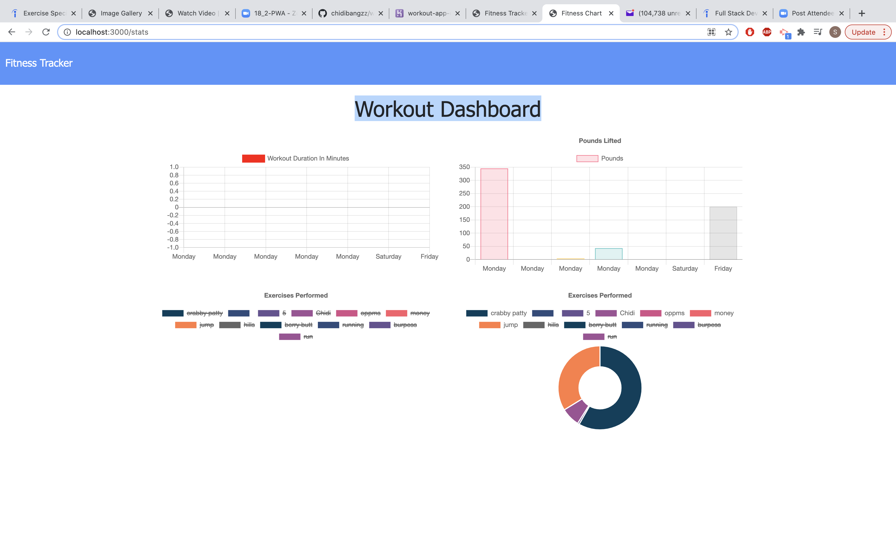

## Project title
Workout fitness
Maximize your fitness by keeping track of your workouts with my workout app.
## Motivation
Fitness and health is an extremly important factor in my life and in so many others. My goal was to help people keep record of the time they worked out and the particular excercise they have done. 
## Screenshots
 

## Tech/framework used
node
<b>Built with</b>
- [Electron](https://electron.atom.io)

## How to use?
When application is loaded the user is given option to
add a new workout and the webpage will display their last workout 
when user add workout they will be given requirements to fill out for their desired workout
When the user adds a workout it will get added to the the load screen along with the total amount of time spent on all the workouts
When the user clicks on Dashboard they will see a graph representation of the last 7 workouts they have done in descending order

## Contribute

Please feel free contritbute to my project by contacting me  A [contributing guideline](https://www.linkedin.com/in/chidi-ekeke-038609172/
## Credits
Ferdinand Aguwa

## License
Javascript, Html, Jquery, mongodb, mongoose, bootsrap, javascript

MIT © [Chidi Ekeke]()